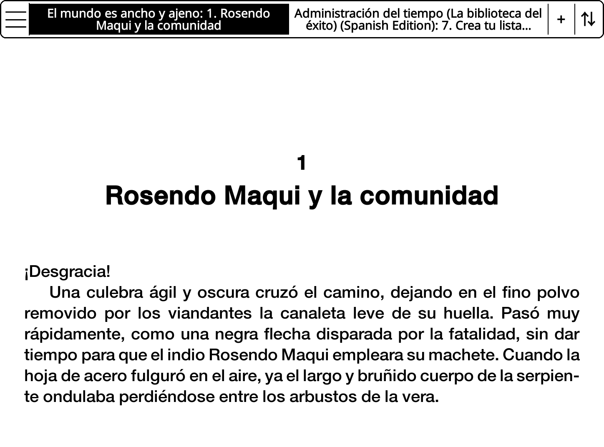
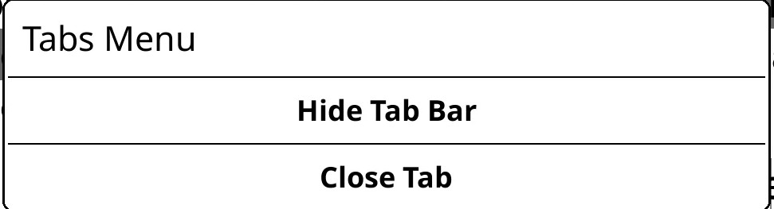
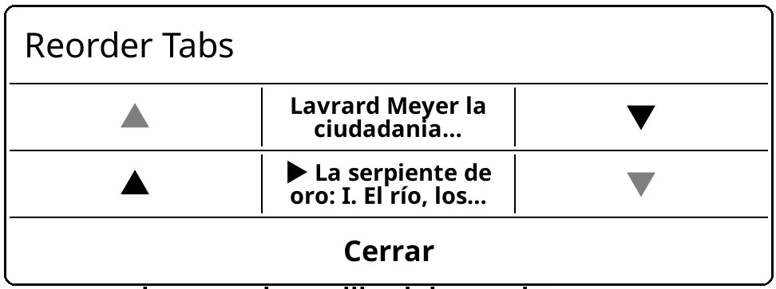
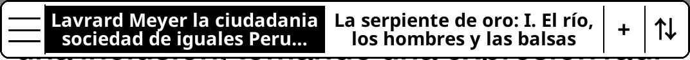

# TabBar — KoReader Plugin

A plugin for [KoReader](https://github.com/koreader/koreader) that adds a persistent tab bar to the reader, allowing you to keep multiple books open simultaneously and switch between them without losing your position in any of them.

Designed for **multitasking, comparing readings, studying, and research** — keep a novel, a reference book, and your notes open at the same time and jump between them instantly.

Developed and tested on a **Kindle Paperwhite 10th generation**. Built with vibecoding using [Claude](https://claude.ai).

Inspired by [tabbedreader.koplugin](https://github.com/KodeshKit/tabbedreader.koplugin) by KodeshKit.

---

## Features

- **Multiple tabs** — open up to 10 books at the same time, each remembering its own page and chapter position.
- **Multi-book support** — each tab can hold a different book. Switch books by tapping a tab; the previous book's position is saved automatically.
- **Tab reordering** — rearrange tabs in any order via a dedicated menu. The active tab follows its new position.
- **Close tabs** — close any tab from the tab menu. The last tab cannot be closed.
- **Show/hide bar** — toggle the tab bar on or off. The preference persists across documents and KoReader restarts.
- **Rotation support** — the tab bar and its touch zones adapt correctly to both portrait and landscape orientations.



---

## Files

```
tabbar.koplugin/
├── main.lua           # Plugin entry point
├── navigationtabs.lua # Tab bar widget (touch zone registration, rendering)
└── README.md
```

---

## Installation

### Option 1 — AppStore (recommended)

Using the [AppStore plugin](https://github.com/omer-faruq/appstore.koplugin):

1. Open KoReader → Tools → App Store.
2. Pick the **Plugins** tab. Use the filter dialog to narrow by name.
3. Search **TabBar** or **tabbar**.
4. Tap the entry for a quick action menu. Choose **Install** to download the repo ZIP.
5. Restart KoReader.

### Option 2 — FileBrowserPlus (no PC required)

Using the [FileBrowserPlus plugin](https://github.com/patelneeraj/filebrowserplus.koplugin):

1. Open KoReader's top menu.
2. Make sure your device is connected to Wi-Fi.
3. Go to Gearbox Menu → Network → FileBrowserPlus.
4. When the server starts, you'll see the IP address and port. Visit that address (e.g., `http://192.168.x.x:8080`) from your phone or computer connected to the same Wi-Fi network.
5. You can change the password or create new users via the FileBrowser web interface.
6. Navigate to the downloaded `tabbar.koplugin/` folder from your other device.
7. Copy the `tabbar.koplugin/` folder to:
   ```
   /mnt/us/koreader/plugins/
   ```
8. Restart KoReader.

### Option 3 — USB

1. Connect your Kindle to a PC via USB.
2. Copy the `tabbar.koplugin/` folder to:
   ```
   /mnt/us/koreader/plugins/tabbar.koplugin/
   ```
3. Restart KoReader (Menu → Help → Restart KoReader).

After any of the above methods, the tab bar will appear automatically the next time you open a document.

---

## Tab bar layout



```
[ ☰ ] [ Book A: Ch.1 ] [ Book B: Ch.4 ] [ + ] [ ⇅ ]
```

| Button | Action |
|--------|--------|
| **☰** (menu) | Opens the tab menu (hide bar / close tab) |
| **Tab label** | Switches to that tab. Shows book title and current chapter |
| **+** | Creates a new tab at the current position. Open a different book from the file explorer to load it into the new tab |
| **⇅** (reorder) | Opens the reorder menu. Only active when there are 2 or more tabs |

---

## Workflow

### Opening a second book in a new tab

1. Press **+** to create a new tab. The new tab starts at the same book and page as the current one.
2. Open the **file explorer** (Menu → Browse Files) and select a different book.
3. The selected book opens inside the new tab.
4. Tap the tab labels to switch between books. Each tab remembers its own page and chapter independently.

### Reordering tabs

1. Press the **⇅** button (rightmost).
2. A menu lists all open tabs. The active tab is marked with ▶.
3. Use the **▲** and **▼** buttons to move a tab up or down.
4. The active tab follows its new position automatically.
5. Press **Close** to dismiss the menu.

### Closing a tab

1. Press **☰** → **Close Tab**.
2. The tab closes and focus moves to the adjacent tab.
3. The last remaining tab cannot be closed.

### Hiding and showing the tab bar

**From the tab menu:**
1. Press **☰** → **Hide Tab Bar**.

**From KoReader's main menu:**
1. Menu → More tools → TabBar.

The bar state (visible or hidden) is saved globally and applies to all documents. To restore the bar, use the same menu entry.

---

## Configuration

There are no configuration files. All settings are managed through the in-reader menus described above. The visibility preference is saved automatically to KoReader's global settings (`settings/reader.lua`) under the key `tabbar_bar_visible`.

The maximum number of tabs is set to **10** in the plugin source (`max_tabs = 10` in `main.lua`) and can be changed manually.

---

## Compatibility

| Device | Status |
|--------|--------|
| Kindle Paperwhite 10th gen | ✅ Tested |
| Other Kindle models | 🔲 Untested, likely works |
| Non-Kindle devices | 🔲 Untested |

---
